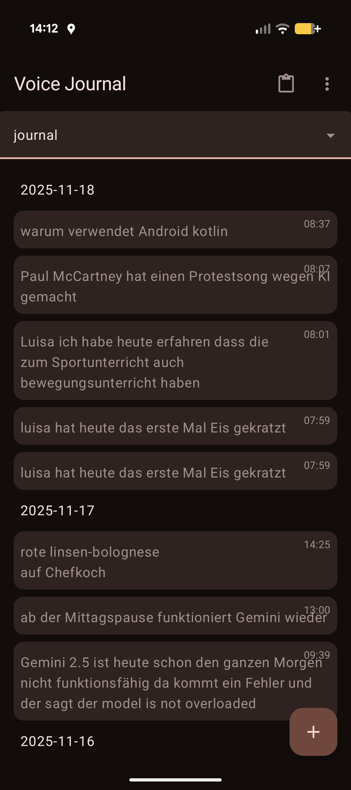

# Voice Journal

Voice Journal is a simple Android app that allows you to record your thoughts and ideas using your voice. The app automatically transcribes your speech and saves it as a journal entry.

## Features

*   **Voice-to-text:** Speak your thoughts and the app will transcribe them into text.
*   **Categories:** Organize your journal entries by categories such as "journal," "todo," "shopping," "hardware store," and "eloisa."
*   **Automatic categorization:** The app automatically assigns a category to your entry based on keywords in your speech.
*   **Offline support:** The app uses a local database to store your journal entries, so you can use it even when you're not connected to the internet.
*   **Splash screen:** The app has a beautiful splash screen that is displayed when the app is launched.

## Screenshot

## Getting Started

To get started with Voice Journal, simply open the app and tap the microphone button. The app will then start listening for your voice. When you're finished speaking, the app will automatically transcribe your speech and save it as a journal entry.

You can then view your journal entries by selecting a category from the drop-down menu at the top of the screen. You can also edit or delete your journal entries by long-pressing on them.

## Contributing

Contributions are welcome! If you have any ideas for new features or improvements, please open an issue or submit a pull request.

## License

Voice Journal is licensed under the MIT License. See the `LICENSE` file for more information.